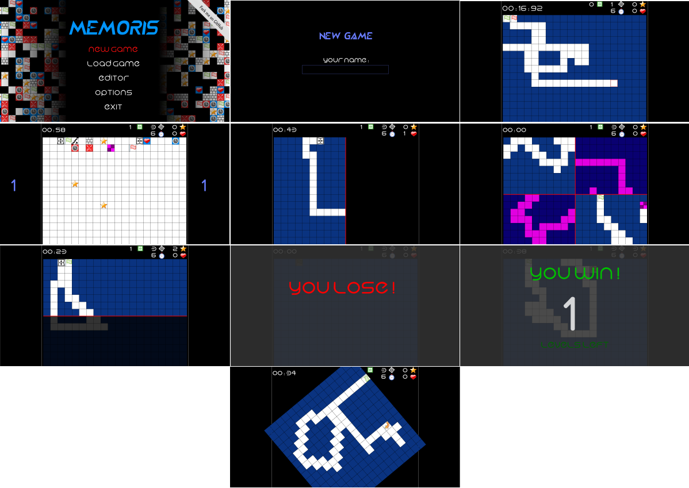

[](https://travis-ci.org/jean553/Memoris)

License : GNU GPL v3

# Memoris



Memoris is a C++ 14 video game developed using the SFML. The main goal is to move a pin on a grid of cells, from the departure to the arrival.
The player has to find all the stars on the map before going to the arrival cell. The whole map is only visible a few seconds before the game
starts. Then, all the cells are hidden. The player has to "memorize" the cells disposition before playing.

The map is full of special cells, including `one life more`, `additional time`... but also `one life less`, `less time`... !
The player has to find all the stars and the arrival before the available time is over.

**NOTE: this work is in progress. Some features are not implemented yet, some of them are partially implemented.**

### License and credits

The program is open-source, distributed under the GNU General Public License.

The game contains many assets (musics, sounds, pictures, fonts... etc...), all of them are distributed under various licenses ( CreativeCommons, GNU GPL/LGPL... etc... ).
(check the `Credits` section for details).

## Compatibility

Successfully compiled and executed on :
 * Ubuntu 14.04 LTS
 * Archlinux (2017-03-01)

## Installation

### Ubuntu 14.04 LTS

Compile and run:
```
curl -s https://raw.githubusercontent.com/jean553/Memoris/master/install.sh | sudo bash
```

### ArchLinux

Clone the project:
```
git clone https://github.com/jean553/Memoris
```

Install required tools:
```
pacman -S gcc cmake sfml
```

## Execution

Execute the game from the root directory :

```
./bin/Memoris
```

## Development

Memoris is developed into a dedicated Docker container including all the required tools and development facilities.
Available here : [memoris-dev](https://github.com/jean553/memoris-dev)

To compile the sources manually, just execute :

```
mkdir build && cd build/
cmake -D CMAKE_CXX_COMPILER=g++ ..
make
```

## Documentation

```
sudo apt-get install doxygen
doxygen
```

## Credits

### Fonts

"Crystal" - http://openfontlibrary.org/en/font/crystal#CRYSTAL-Regular - Felipe Munoz - CreativeCommons BY 3.0 ( https://creativecommons.org/licenses/by/3.0/ )
This font is distributed under the CreativeCommons BY 3.0 terms (check licenses/cc_by_3.txt for details)

"Hi" - http://openfontlibrary.org/en/font/hi - Mew Too, Robert Jablonski - SIL Open Font License ( http://scripts.sil.org/cms/scripts/page.php?site_id=nrsi&id=OFL )
This font is distributed under the SIL Open Font License terms (check licenses/hi_font_sil_ofl.txt for details)

### Musics

Zeropage - Ambient Pills Update - Ambient Dance - CreativeCommons 3.0 BY (https://www.jamendo.com/track/23557/ambient-dance) (https://creativecommons.org/licenses/by/3.0/)

Zeropage - Ambient Pills - Void Sensor - CreativeCommons 3.0 BY (https://www.jamendo.com/track/20233/void-sensor) (https://creativecommons.org/licenses/by/3.0/)

Zeropage - Ambient Pills - Ambiose - CreativeCommons BY (https://www.jamendo.com/track/20235/ambiose) (https://creativecommons.org/licenses/by/3.0/)

Jamendo licenses information note: https://www.jamendo.com/legal/licenses

Music files have been converted from MP3 to OGG format. This is the only modification.

### Icons

https://www.iconfinder.com/recepkutuk - Free for commercial use

https://www.iconfinder.com/iconsets/aiga-symbol-signs - Public domain

https://www.iconfinder.com/andromina - CreativeCommons 3.0 BY http://creativecommons.org/licenses/by/3.0/ - No changes have been made

http://www.webdesignerdepot.com/2009/03/200-free-exclusive-icons-siena/ - Free for commercial use with link to author website

http://www.danilodemarco.com/100-pictograms-icons/ - Free for commercial use with link to author website

http://www.icons-gallery.com - GNU GPL / GNU LGPL

https://www.iconfinder.com/snipicons - CreativeCommons - BY-NC 3.0 - http://creativecommons.org/licenses/by-nc/3.0/ ( images have been resized and integrated in others )

http://appercuts.blogspot.fr/ - Free for commercial use with link to author website

https://www.iconfinder.com/Squid.ink / http://thesquid.ink/flat-icons/ - CreativeCommons - BY 3.0 - http://creativecommons.org/licenses/by/3.0/

https://www.iconfinder.com/icons/1055053/controller_game_controller_video_game_icon#size=128 / http://www.elegantthemes.com/ - GNU GPL

http://code.google.com/u/newmooon/ - GNU GPL

https://www.iconfinder.com/paomedia - CreativeCommons - BY 3.0 - https://creativecommons.org/licenses/by/3.0/

https://www.elegantthemes.com/ - https://www.iconfinder.com/iconsets/circle-icons-1 - GNU GPL

https://www.iconfinder.com/icons/186411/arrow_down_icon#size=64 - Free for commercial use
