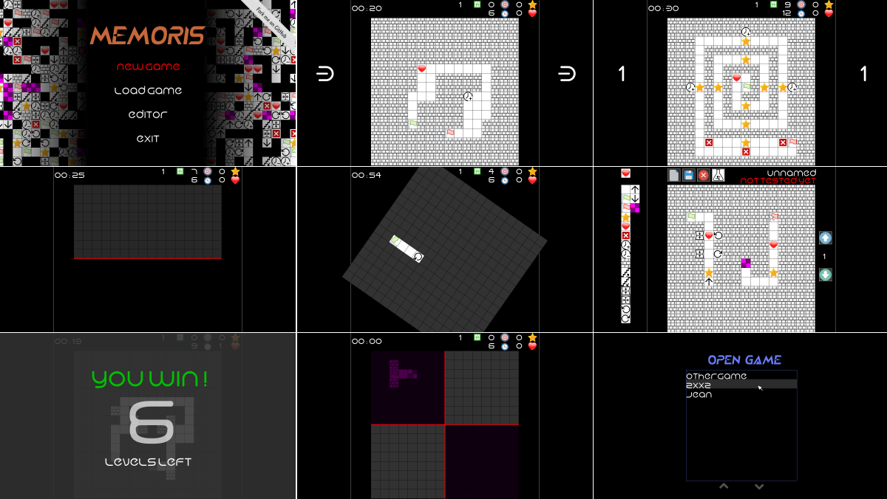

[](https://travis-ci.org/jean553/Memoris)

License : GNU GPL v3

# Memoris



Memoris is a video game developed in C++ using the SFML library. During the game, the player moves a pin on a 2D map. The map contains floors. Each floor contains cells. The player can move the pin from one cell to another. The goal is to move the pin from the departure to the arrival, find all the stars on the map, take the bonus ( life, time... etc... ), avoid the malus ( life minus one, less time... etc... )... etc... The map contains different kind of events that change the cells dispositions ( horizontal/vertical symmetry, rotation, translation, move from one floor to another... etc... ).

Before each level, the player can see all the cells of the level during a limited time ( a few seconds... ). After this period, all the cells of the level are hidden and the pin can move.

The game is divided into series, each series contain different level. Levels are integrated into the game. The player can also create his own series and levels.

**NOTE: this work is in progress. Some features are not implemented yet, some of them are partially implemented.**

### Participate in the project

**Any developer, musician or designer is welcome to participate in the Memoris project !** 

Just keep in mind that the project is free and open source. There is no reward... only two things : learning and having fun ! :) Anyone is invited to open issues, provide functionality, test the game, bring ideas, refactor code ( yeah... I'm sorry... :( ), compose musics, create fonts, create pictures and more !

### License and credits

The program is open-source, distributed under the GNU General Public License. The game uses many assets ( musics, sounds, pictures, fonts... etc... ), all of them are distributed under various licenses ( CreativeCommons, GNU GPL/LGPL... etc... ). 

After individual verification of each asset license, all of them can be integrated in the project. Each asset source is recorded in the "Credits" section of the README.md file. 

**If you are the author of some of them and you don't want these resources to be used in Memoris, just let me know. The asset will be deleted immediately.**

## Installation

### Compatibility

Memoris has been compiled and executed successfully on :
- Debian 8
- Ubuntu 14.04 LTS
- Ubuntu 15.04

### Compilation

Memoris uses the version 2.1 of the SFML library and CMake.

```
sudo apt-get update
sudo apt-get install -y libsfml-dev cmake
```

Compile the application with CMake ( Debian 8 only ) :

```
mkdir build && cd build/
cmake ..
make -j
```

Compile the application ( all distributions ) :

```
make -j
```

### Execution

Execute the game from the root directory :

```
./bin/Memoris
```

### Documentation

The documentation can be generated by using Doxygen. The package is available in the Debian repositories.

```
sudo apt-get install doxygen
doxygen
```

### Apply Allman coding style

```
./style.sh
```

## Credits

### Fonts

"Crystal" - http://openfontlibrary.org/en/font/crystal#CRYSTAL-Regular - Felipe Munoz - CreativeCommons BY 3.0 ( https://creativecommons.org/licenses/by/3.0/ )

"Hi" - http://openfontlibrary.org/en/font/hi - Mew Too, Robert Jablonski - SIL Open Font License ( http://scripts.sil.org/cms/scripts/page.php?site_id=nrsi&id=OFL )

### Musics

Zeropage - Ambient Pills Update - Ambient Dance - CreativeCommons 3.0 BY (https://www.jamendo.com/track/23557/ambient-dance) (https://creativecommons.org/licenses/by/3.0/)

"J.O.R.B.Y" - Another Day - Dancing of the Night - CreativeCommons 3.0 BY (https://www.jamendo.com/track/1341169/2-dancing-of-the-night) (http://creativecommons.org/licenses/by/3.0/)

Music files have been converted from MP3 to OGG format. This is the only modification.

### Icons

https://www.iconfinder.com/recepkutuk - Free for commercial use

https://www.iconfinder.com/iconsets/aiga-symbol-signs - Public domain

https://www.iconfinder.com/andromina - CreativeCommons 3.0 BY http://creativecommons.org/licenses/by/3.0/ - No changes have been made

http://www.webdesignerdepot.com/2009/03/200-free-exclusive-icons-siena/ - Free for commercial use with link to author website

http://www.danilodemarco.com/100-pictograms-icons/ - Free for commercial use with link to author website

http://www.icons-gallery.com - GNU GPL / GNU LGPL

https://www.iconfinder.com/snipicons - CreativeCommons - BY-NC 3.0 - http://creativecommons.org/licenses/by-nc/3.0/ ( images have been resized and integrated in others )

http://appercuts.blogspot.fr/ - Free for commercial use with link to author website

https://www.iconfinder.com/Squid.ink / http://thesquid.ink/flat-icons/ - CreativeCommons - BY 3.0 - http://creativecommons.org/licenses/by/3.0/

https://www.iconfinder.com/icons/1055053/controller_game_controller_video_game_icon#size=128 / http://www.elegantthemes.com/ - GNU GPL
